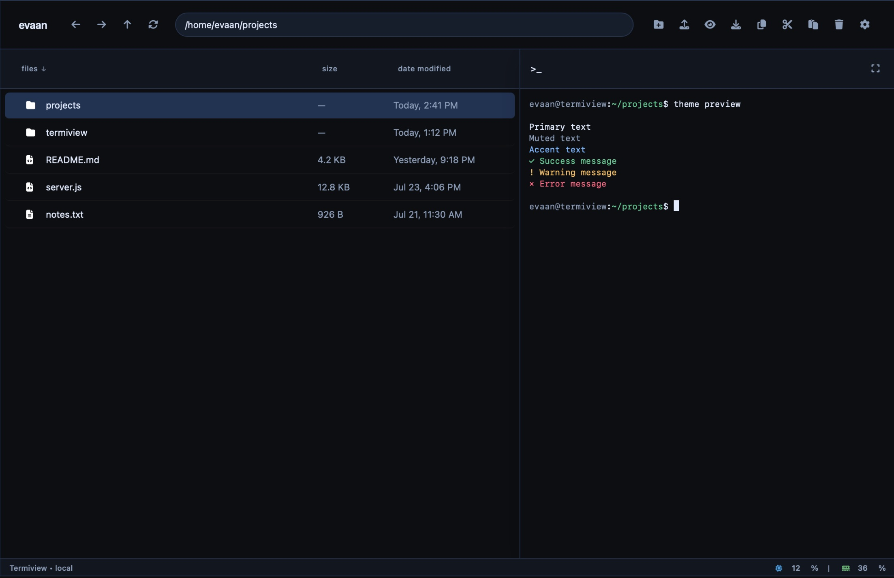

<p align="center">

</p>
<h1 align="center">Termiview</h1>
<p align="center">Termiview is a powerful web-based file explorer with terminal integration, system monitoring, and modern UI. Built with Node.js and designed for efficiency and ease of use.</p>
<p align="center">


</p>

<p align="center">

</p>

## Features

- **File Management** - Browse, upload, download, and manage files with drag-and-drop support
- **Terminal Integration** - Built-in web terminal for running commands directly from the browser
- **System Monitoring** - Real-time CPU, memory, and GPU usage monitoring
- **File Preview** - Preview text files, images, and media directly in the browser
- **Fast & Responsive** - Built with modern web technologies for optimal performance
- **Modern UI** - Clean, intuitive interface inspired by modern design principles
- **Live File Updates** - Changes on disk appear in the explorer immediately
- **macOS & Linux Support** - Runs natively on both platforms with automatic OS detection
- **GitHub Updates** - Optional update source lets an installed instance check and install new releases

## Installing

### Docker (Recommended)

#### Linux
```bash
curl -o docker-compose.yml https://raw.githubusercontent.com/matonhp5108/termiview/main/docker-compose.yml
curl -o start.sh https://raw.githubusercontent.com/matonhp5108/termiview/main/start.sh
chmod +x start.sh
./start.sh -d
```

#### macOS
```bash
curl -o docker-compose.yml https://raw.githubusercontent.com/matonhp5108/termiview/main/docker-compose.yml
curl -o start.sh https://raw.githubusercontent.com/matonhp5108/termiview/main/start.sh
chmod +x start.sh
./start.sh -d
```

`start.sh` automatically detects your OS and sets the correct volume paths - no configuration needed.

Compose installs also check `phantom8015/termiview:latest` every five minutes. Docker images are built on every commit, but `latest` advances only when a GitHub Release is published from [matonhp5108/termiview](https://github.com/matonhp5108/termiview/releases). The app then displays an update notification with **Update now** and **Later** buttons.

To release an update, create a GitHub Release (for example, `v1.0.1`) from a tag in `matonhp5108/termiview`. The workflow publishes that release image as `phantom8015/termiview:latest`; the next update check will offer it to running apps.

#### Using Docker Run

**Linux:**
```bash
docker run -d \
  --name termiview \
  -p 3000:3000 \
  -v /home:/app/managed/home:rw \
  -v /var/log:/app/managed/logs:ro \
  --restart unless-stopped \
  phantom8015/termiview:latest
```

**macOS:**
```bash
docker run -d \
  --name termiview \
  -p 3000:3000 \
  -v /Users:/app/managed/home:rw \
  -v /var/log:/app/managed/logs:ro \
  --restart unless-stopped \
  phantom8015/termiview:latest
```

### Traditional Installation

#### Quick Install Script (Linux & macOS)
```bash
curl -fsSL https://raw.githubusercontent.com/matonhp5108/termiview/main/install.sh | bash
```

The install script automatically detects your OS and:
- **Linux** - installs Node.js via NodeSource, sets up a systemd service
- **macOS** - installs Node.js via Homebrew, sets up a launchd service (auto-starts on login)

### Manual Installation

**Requirements:** Node.js 16+, Git, NPM

```bash
git clone https://github.com/matonhp5108/termiview.git
cd Termiview
npm install
npm start
```

Then open `http://localhost:3000` in your browser.

---

## Updating an Instance

Termiview checks [matonhp5108/termiview Releases](https://github.com/matonhp5108/termiview/releases) when it starts and every five minutes. When a new release is available, select **Update now** in the notification. Docker Compose deployments pull and restart with the matching published image; native installs check out the release tag, install production dependencies, and restart.

## Contributing

1. Fork the repository
2. Create your feature branch (`git checkout -b feature/amazing-feature`)
3. Commit your changes (`git commit -m 'Add some amazing feature'`)
4. Push to the branch (`git push origin feature/amazing-feature`)
5. Open a Pull Request

## License

This project is open source and available under the [MIT License](LICENSE).

## Issues & Support

- **Issues**: [GitHub Issues](https://github.com/matonhp5108/termiview/issues)
- **Contact**: [matonhp5108](https://github.com/matonhp5108)
